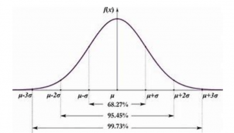

# **Chapter 7 Statistics**

##  Main objectives  
1. choosing a right statical method  
2. Do's and dont's of statistics
3. Reliable results
4. Paper revisions with proof of statistical test(WhQ s)
5. Making Data Visualization
6. Interpreting result  

## Tests and their types  
### Parametric Tests
1. More Reliable results  
2. First we have meet the assumptions  

| 2 | 25 |  
|---|----|
| 5 | 38 |  
| 16 | 52 |  
| 18 | 100|  
| 20 | 100| 

Not equal!

### Non-parametric Tests
1. Less reliable results
2. Calculates the rank of data
3. No need to make the assumptions

| 1 | 1 |  
|---|----|
| 2 | 2 |  
| 3 | 3 |  
| 4 | 4|  
| 5 | 5|  

**Note: Before starting data analysis always check the normality of data ** 

### Normality test
Normality refers to a specific statistical distribution called a normal distribution, or sometimes the Gaussian distribution or [bell-shaped curve](https://www.isixsigma.com/dictionary/normality-test/). The normal distribution is a symmetrical continuous distribution defined by the mean and standard deviation of the data.

  
There are some properties of the normal distribution:
1. Bell-shaped
2. Symmetrical
3. Unimodal — it has one “peak”
Mean and median are equal; both are located at the center of the distribution
4. About 68% of data falls within +/- one standard deviation of the mean
5. About 95% of data falls within +/- two standard deviations of the mean
6. About 99.7% of data falls within +/- three standard deviations of the mean  

### Tests to be used:  
1. Shapiro-wilk test  

   - Specific (Reliable)

2. Kolmogorov-Smirnov test

     - General (less reliable)  

### 2. Homogeneity test  
A data set is [homogeneous](https://www.statisticshowto.com/homogeneity-homogeneous/) if it is made up of things (i.e. people, cells or traits) that are similar to each other.  
### Test to be used  
1. Levene's tets
   
### Purpose  
know the puorpose of your research question  
### Two type of purpose 
1. Comparison  

   - Difference

2. Relationship

     - Connection  
  
####  Comparison  
if your purpose is comparison the compare atleast two groups  
Examples:  
1. Male vs Female 
2. Control group vs treatment group 
3. Grouping individual by color preference  

####  Relationship  
To find a connection  
Examples:  
1. Can food predict weight of a group of individuals 
2. do fertilizer application increase crop growth?

We seek following here:  

- Connection  
- Correlayion
- Causation
- Prediction  

## Data type  
Know the type of data you are working with  
### CATEGORICAL  
No numerical meaning represented in texts
(e.g：character， factors)
Qualitative  
EXAMPLES:  
- Yes and No answers  
(Have you ever been to Lahore?)
Which gene was expressed?
Do you like Mangoes?" yes"or"No"
### CONTINUOUS  
Mostly represented in
(e.g：Numerical variable，
Quantitative
Numerical
number
int and float)  
Quantitative  
EXAMPLES：
- Amount
- Number
- Age
- Plant Height
- Number of bacterial colonies
- Chlorophyll content
- Fertilizer Amount  

## Statistical tests  
Choose a statistical test from three families  
### 3 Families of statiscal tests  
1. Chi-Squared
   - Purpose：Comparison
   - Data：Categorical only
(Chi-Squared)
2. t-Test/ANOVA
   - Purpose：Comparison
   - Data：Categorical and continuous
(t_Test)  
3. Correlation
   - Purpose：Relationship
   - Data：continuous only
(Corrrelation)  
#### Chi-Squared  
   - Purpose：Comparison
   - Data：Categorical only
(Chi-Squared)  
##### When and where to use?  
**Types:**  
1.Chi-Squared test of homogeneity  
2.Chi-squared test of independence 

**When to use?**  
   - Nothing effects this，
   - Can be used with any number of levels
or groups  

You must remember the
purpose and datatype  
#### t-Test/ANOVA
   - Purpose：Comparison
   - Data：Categorical and continuous 
   - (t_Test)  

##### When and where to use?  
**Types：**  
1. One-sample t-Test(for one sample group with a
know mean)  
2. Two-sample t-Test：  
- Un-paired t-Test(Two different groups)
-  Paired t-Test (Same group Twice)
3. **ANOVA** (Analysis of Variance) [3+levels or groups
are involved]
- **One-way ANOVA** (Even one of group is
significant you will get significant results， but
doesn't tell you which one)  
- **Two-way ANOVA**  
- **Repeated measures of ANOVA** (3+paired
groups， scale up of Paired t-Test)  
#### Correlation
   - Purpose：Relationship
   - Data：continuous only
(Corrrelation)  
##### When and where to use?  
**Types：**  
1. **Pearson's Correlation** (one-Independent an
One-Dependent Variable)
2. **Regression** (one-Independent and One-
Dependent Variable) 

**Correlation:** Tells us how closely cone nc ted two
variables are?  
"Is food a predictor of weight gain?"  

**Regression:** Tells usa specific mathematical
equation that describes the relationship.  
(This helps us to find the data points not measured yet)  
e.g：missing values can be predicted like this!  

## Important Things  
### Assumptions about your data 
These tests trusts you that:  
- **Your data is Normally distributed**
- **or follow a Gaussian distribution**

**If you do not follow the assumptions and break the trusts
of 3-test families， they will not happy with you!**  

 
### If Assumptions are not met! then  

1. Normalize your Data  
a. Standardization  
b. Min-max scaling  
c. Log transformation  
2. Use Alternative Non-Parametric Tests  

#### Non-parametric test  
| 1    | 2    | 3   |
|------|-------|-----|
|Chi-Squared |t-Test/ANOVA |Correlation|
Purpose：Comparison Data：Categorical only (Chi-Squared) |  Purpose：Comparison Data：Categorical and continuous (t_Test)| Purpose：Relationship  Data：continuous only (Corrrelation)| 
| Chi-Squared |  One-sample t-Test One-Sample Wilcoxon Signed rank test  2.Two-sample t-Test a.Unpaired t-Test(Mann Whitney'sU-Test) b.Paired t-Test(Wilcoxon) 3.ANOVA(Kruskal-Wallis test) |Pearson's Correlation (Spearman's Correlation) & (Kendall'sTau) Regression  

### ANOVA 
- Purpose：Comparison
- Data：Categorical and   

#### Types of ANOVA

**ANOVA** (Analysis of Variance) [3+levels or groups
are involved]
- **One-way ANOVA** (Even one of group is
significant you will get significant results， but
doesn't tell you which one)  
- **Two-way ANOVA**  
- **Repeated measures of ANOVA** (3+paired
groups， scale up of Paired t-Test)  

**ANCOVA** (Analysis of Co-variance)  
- Compare the means of 3+iden pendent groups which can
not be tested by ANOVA because the variables are
affected by co-variance(pre-test and post-Test of class)  

**MANOVA** (Multi-variate analysis of Variance)  

**MANCOVA** (Multi-variate analysis of Co-variance)  

### Some other test  

#### Reliability tests  
- K under-Richardson's
Formula 20and 21
(KR20/21)
- Cronbach's Alpha  

#### Inter-rater Reliability tests
- Krippendorf's Alpha
  - (Categorical or continuous)  
   
- Fleis's Kappa
  - (Only Categorical)  

- Validity tests  
  - Krippendorf's Alpha Test
  - Fle is's Kappa Test  

- Sample size computation  
  **How to make sure how
many samples are valid?**  
  - Cochran'sQ Test  
  - Yamane's Test  
  - many others.....  

# Whole Process diagram  
